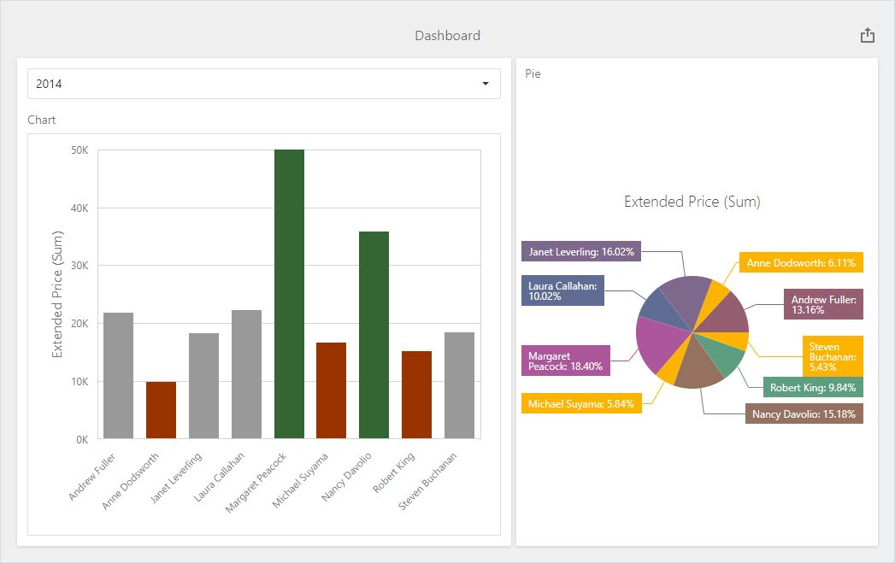

<!-- default badges list -->

<!-- default badges end -->

# Dashboard for Web Forms - How to Color Dashboard Item Elements

The following example shows how to color dashboard item elements at runtime. For this, handle the [ViewerApiExtensionOptions.onItemElementCustomColor](https://docs.devexpress.com/Dashboard/js-DevExpress.Dashboard.ViewerApiExtensionOptions?p=netframework#js_devexpress_dashboard_viewerapiextensionoptions_onitemelementcustomcolor) event. Get the item's [multidimensional data](https://docs.devexpress.com/Dashboard/403003/web-dashboard/dashboard-control-for-javascript-applications-jquery-knockout-etc/obtain-underlying-and-displayed-data#client-data-structure) and apply the color to the dashboard item's element based on the condition.

The image below displays the dashboard items whose values are colored based on their values:

- [Chart item](https://docs.devexpress.com/Dashboard/117159/web-dashboard/create-dashboards-on-the-web/dashboard-item-settings/chart#client-data-structure): For 2014 year, values that exceed 30k are colored in green, values below 17k are colored in red, and values that fall into the range between 170k and 30k are colored in gray.
- [Pie item](https://docs.devexpress.com/Dashboard/117162/web-dashboard/create-dashboards-on-the-web/dashboard-item-settings/pies#client-data-structure): Values below 80k are colored in yellow.

## Files to Look At

* [ElementCustomColor.js](./CS/ASPxDashboard_ElementCustomColor/Scripts/ElementCustomColor.js) (VB: [ElementCustomColor.js](./VB/ASPxDashboard_ElementCustomColor/Scripts/ElementCustomColor.js))
* [WebForm1.aspx](./CS/ASPxDashboard_ElementCustomColor/WebForm1.aspx) (VB: [WebForm1.aspx](./VB/ASPxDashboard_ElementCustomColor/WebForm1.aspx))
* [WebForm1.aspx.cs](./CS/ASPxDashboard_ElementCustomColor/WebForm1.aspx.cs) (VB: [WebForm1.aspx.vb](./VB/ASPxDashboard_ElementCustomColor/WebForm1.aspx.vb))

## Documentation

- [Coloring Basics](https://docs.devexpress.com/Dashboard/116915)
- [Coloring in the Web Dashboard](https://docs.devexpress.com/Dashboard/117152)

## More Examples

- [Dashboard for ASP.NET Core - How to Customize the Color Palette](https://github.com/DevExpress-Examples/asp-net-core-dashboard-customize-color-palettes)
